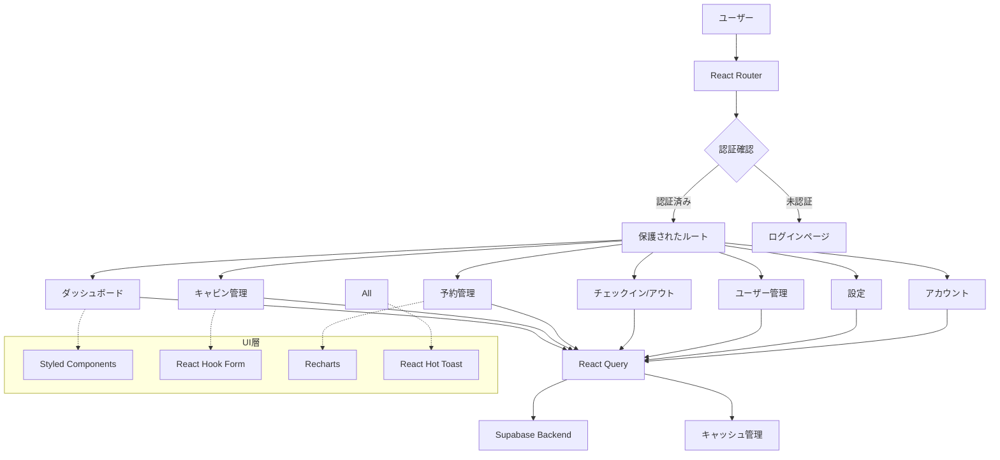
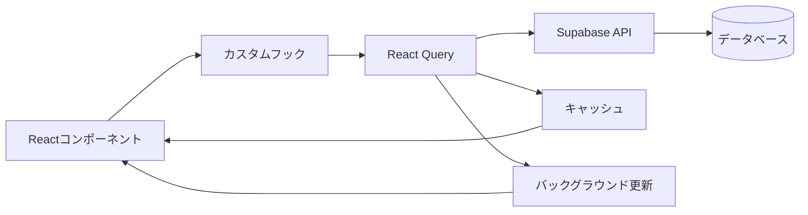
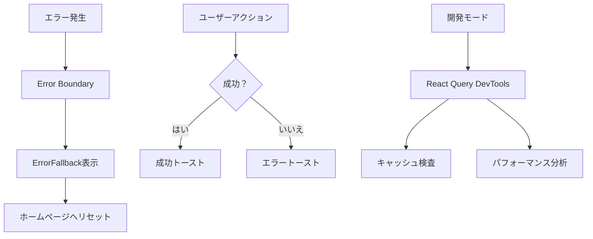

# The Wild Oasis システム概要

## 概要

**関連ソースファイル**
* src/App.jsx
* src/main.jsx
* package.json
* src/ui/ErrorFallback.jsx
* src/services/
* src/features/
* src/hooks/
* src/context/
* src/utils/
* src/styles/

## 目的と範囲

The Wild Oasisは、ホテルの内部スタッフがキャビン、予約、ゲスト、日常業務を管理するためのReactベースのホテル管理アプリケーションです。この概要では、アプリケーションのアーキテクチャ、コア技術、システム構成についての高レベルな理解を提供します。

このドキュメントでは、全体的なシステム構造と主要コンポーネントをカバーします。特定のサブシステムの詳細情報については、以下を参照してください：

* 認証フロー: **認証システム**
* ビジネス機能の実装: **コア機能**
* UIコンポーネントのアーキテクチャ: **UIシステム & コンポーネント**
* バックエンド統合パターン: **API統合**

## アプリケーションアーキテクチャ

The Wild Oasisは、フロントエンドプレゼンテーション、ステート管理、バックエンドサービス間の明確な関心の分離を持つ、モダンなReactシングルページアプリケーションアーキテクチャに従います。

## システム構成図



## 高レベルシステム構造

```
src/
├── App.jsx                 # アプリケーションのエントリーポイント
├── main.jsx               # Reactアプリのブートストラップ
├── features/              # ビジネス機能別コンポーネント
│   ├── dashboard/
│   ├── cabins/
│   ├── bookings/
│   ├── check-in-out/
│   ├── users/
│   └── settings/
├── ui/                    # 再利用可能なUIコンポーネント
├── services/              # API層とビジネスロジック
├── hooks/                 # カスタムReactフック
├── context/               # React Context API
├── utils/                 # ユーティリティ関数
└── styles/               # グローバルスタイル
```

**ソース:** `src/App.jsx (1-95)`, `package.json (12-25)`

## コア技術スタック

| 技術 | 用途 | バージョン |
|------|------|----------|
| React | フロントエンドフレームワーク | ^18.2.0 |
| React Router DOM | クライアントサイドルーティング | ^6.25.1 |
| @tanstack/react-query | ステート管理 & キャッシング | ^4.36.1 |
| @supabase/supabase-js | Backend-as-a-Service | ^2.44.4 |
| styled-components | CSS-in-JSスタイリング | ^6.1.12 |
| react-hook-form | フォーム管理 | ^7.52.1 |
| recharts | データ可視化 | ^2.12.7 |
| Vite | ビルドツール & 開発サーバー | ^4.5.5 |

**ソース:** `package.json (12-25)`, `package.json (27-39)`

## アプリケーションエントリーポイントとルーティング構造

```jsx
// main.jsx - アプリケーションブートストラップ
import React from "react";
import ReactDOM from "react-dom/client";
import { ErrorBoundary } from "react-error-boundary";
import App from "./App.jsx";
import ErrorFallback from "./ui/ErrorFallback.jsx";
import GlobalStyles from "./styles/GlobalStyles.js";

ReactDOM.createRoot(document.getElementById("root")).render(
  <React.StrictMode>
    <ErrorBoundary fallback={<ErrorFallback />}>
      <GlobalStyles />
      <App />
    </ErrorBoundary>
  </React.StrictMode>,
);
```

```jsx
// App.jsx - ルーティング設定
import { BrowserRouter, Navigate, Route, Routes } from "react-router-dom";
import { QueryClient, QueryClientProvider } from "@tanstack/react-query";
import { ReactQueryDevtools } from "@tanstack/react-query-devtools";

const queryClient = new QueryClient({
  defaultOptions: {
    queries: {
      staleTime: 0,
    },
  },
});

function App() {
  return (
    <QueryClientProvider client={queryClient}>
      <ReactQueryDevtools initialIsOpen={false} />
      <BrowserRouter>
        <Routes>
          <Route element={<AppLayout />}>
            <Route index element={<Navigate replace to="dashboard" />} />
            <Route path="dashboard" element={<ProtectedRoute><Dashboard /></ProtectedRoute>} />
            <Route path="bookings" element={<ProtectedRoute><Bookings /></ProtectedRoute>} />
            <Route path="cabins" element={<ProtectedRoute><Cabins /></ProtectedRoute>} />
            <Route path="users" element={<ProtectedRoute><Users /></ProtectedRoute>} />
            <Route path="settings" element={<ProtectedRoute><Settings /></ProtectedRoute>} />
            <Route path="account" element={<ProtectedRoute><Account /></ProtectedRoute>} />
          </Route>
          <Route path="login" element={<Login />} />
        </Routes>
      </BrowserRouter>
    </QueryClientProvider>
  );
}
```

**ソース:** `src/main.jsx (1-17)`, `src/App.jsx (30-68)`

アプリケーションは保護されたルーティング戦略を実装しており、ほとんどのルートは`ProtectedRoute`コンポーネントを通じた認証が必要で、未認証ユーザーはログインページのみアクセス可能です。ルートパス(`/`)は自動的に`/dashboard`にリダイレクトされます。

## ステート管理とデータフロー

アプリケーションはReact Query (`@tanstack/react-query`)を主要なステート管理ソリューションとして使用し、サーバーステートの同期、キャッシング、バックグラウンド更新を提供します。データフローは以下のパターンに従います：



**ソース:** `src/App.jsx (21-28)`, `package.json (13-14)`

React Queryクライアントは`staleTime`を0に設定して構成されており、新鮮なデータフェッチを保証し、クエリステートのデバッグ用の開発ツールを含んでいます。

## コア機能エリア

アプリケーションは5つの主要なビジネスドメインに整理されています：

| 機能 | ルート | 目的 |
|------|---------|------|
| ダッシュボード | `/dashboard` | 分析と今日のアクティビティ概要 |
| キャビン管理 | `/cabins` | ホテルキャビンのCRUD操作 |
| 予約管理 | `/bookings`, `/bookings/:id` | 予約ライフサイクル管理 |
| チェックイン/アウト | `/checkin/:bookingId` | ゲストの到着と出発プロセス |
| ユーザー管理 | `/users` | スタッフアカウント管理 |
| 設定 | `/settings` | アプリケーション構成 |
| アカウント | `/account` | 現在のユーザープロファイル管理 |

**ソース:** `src/App.jsx (46-63)`

## エラーハンドリングと開発ツール

アプリケーションはReact Error Boundaryを通じて包括的なエラーハンドリングを実装し、デバッグ用の開発ツールを提供します：

### エラーハンドリング機能
* **Error Boundary**: `ErrorFallback`コンポーネントを介してユーザーフレンドリーなエラーメッセージをキャッチして表示
* **React Query DevTools**: キャッシュステートとクエリパフォーマンスを検査するための開発環境で利用可能
* **Hot Toast Notifications**: `react-hot-toast`を介したアクションとエラーのユーザーフィードバック
* **Global Styles**: styled-componentsによる一貫したテーマ設定



**ソース:** `src/main.jsx (9-14)`, `src/App.jsx (34-89)`, `src/ui/ErrorFallback.jsx (36-51)`

エラーバウンダリは、ユーザーがエラーに遭遇した際に自動的にホームページにリセットし、優雅な回復メカニズムを提供します。

## システムの特徴

### セキュリティ
- 認証ベースのルート保護
- Supabaseによる安全なバックエンド接続
- セッション管理とトークンハンドリング

### パフォーマンス
- React Queryによる効率的なデータキャッシング
- Viteによる高速な開発環境
- コンポーネントベースの遅延ローディング

### 開発者体験
- TypeScriptサポート準備
- Hot Module Replacement
- 包括的なエラーハンドリング
- 開発ツールの統合

### ユーザーエクスペリエンス
- レスポンシブデザイン
- リアルタイムデータ更新
- 直感的なナビゲーション
- 適切なローディング状態管理
